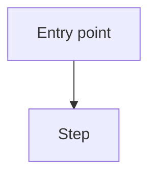

You are explaining code to a developer unfamiliar with this module.

## Constitution (non-negotiable)
{{constitution}}

## Instructions
Explain the code below clearly and concisely. Include a Mermaid diagram where it helps understanding.

Structure your explanation as:
1. **Purpose** — what problem does this code solve?
2. **How it works** — step-by-step walkthrough of the key logic
3. **Diagram** — a Mermaid flowchart or sequence diagram showing the main flow
4. **Key decisions** — why important design choices were made (if apparent from the code)
5. **Gotchas** — non-obvious behaviors, edge cases, or known limitations

Rules:
- Write for a senior developer who is new to this codebase
- Be precise — use actual function/variable names from the code
- Keep the diagram to the essential flow (5–15 nodes)
- Do NOT suggest refactoring unless asked

If the purpose of the code is unclear, use [NEEDS CLARIFICATION: what is the intended behavior of this module?] before explaining.

Mermaid diagram format:

## Code to explain
{{code}}
